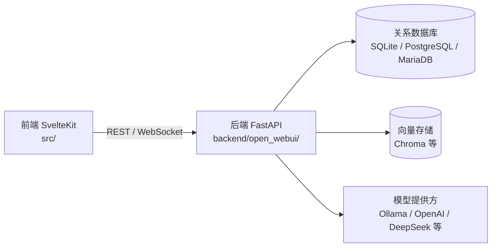

# Open WebUI 项目说明文档

> 版本：0.11.0
> 仓库：open-webui/open-webui
> 本文档面向开发者与维护者，介绍项目的整体定位、技术栈、系统架构以及各模块的功能。

## 1. 项目概述

Open WebUI 是一个可自托管、可扩展、功能丰富且面向离线的 AI 平台。它提供了一个 Web 界面，用于与各种大语言模型（LLM）进行对话，并集成了模型管理、知识库检索增强（RAG）、插件/工具、自动化、多用户权限管理等能力。

核心特性包括：

- **模型接入**：支持本地 Ollama 模型以及任意 OpenAI 兼容 API（如 DeepSeek、LMStudio、Groq、OpenRouter、vLLM 等）。
- **RAG 检索增强**：内置文档加载、向量化与检索，支持多种向量数据库与网页搜索。
- **插件与工具**：支持 Filter、Action、Pipe、Tool、Skill 等扩展方式，并可通过 MCP、OpenAPI 接入外部工具。
- **多用户与权限**：提供基于用户、角色、组的 RBAC 权限模型，支持 LDAP/Active Directory、OAuth、SCIM 等企业级认证。
- **丰富应用场景**：聊天、笔记、频道（Channels）、日历、自动化任务、模型评估、图像生成、语音等。
- **灵活部署**：支持 Docker、Docker Compose、Kubernetes，以及直接使用 Python/Node 的本地开发方式。

许可证信息见仓库根目录的 `LICENSE` 文件。

## 2. 技术栈

### 2.1 前端

| 类别            | 技术                                     |
| --------------- | ---------------------------------------- |
| 框架            | Svelte 5 + SvelteKit 2                   |
| 构建            | Vite 5                                   |
| 语言            | TypeScript                               |
| 样式            | Tailwind CSS 4                           |
| 富文本编辑      | Tiptap / ProseMirror                     |
| 代码编辑器      | CodeMirror                               |
| 图表与绘图      | Mermaid、KaTeX、Chart.js、Vega/Vega-Lite |
| 终端模拟        | xterm.js                                 |
| 浏览器内 Python | Pyodide                                  |
| 实时通信        | socket.io-client                         |
| 协作编辑        | Yjs / y-prosemirror                      |
| 国际化          | i18next                                  |

前端依赖与脚本统一在 `package.json` 中管理，前端版本号同时是前后端共享的版本来源。

### 2.2 后端

| 类别        | 技术                                                                                            |
| ----------- | ----------------------------------------------------------------------------------------------- |
| Web 框架    | FastAPI                                                                                         |
| ASGI 服务器 | Uvicorn                                                                                         |
| 数据校验    | Pydantic                                                                                        |
| ORM         | SQLAlchemy（异步）                                                                              |
| 数据库迁移  | Alembic                                                                                         |
| 实时通信    | python-socketio                                                                                 |
| 会话管理    | Starlette Session / starsessions（支持 Redis）                                                  |
| 认证与安全  | PyJWT、Authlib、argon2、bcrypt、cryptography                                                    |
| HTTP 客户端 | httpx、aiohttp、requests                                                                        |
| 任务调度    | APScheduler                                                                                     |
| 代码执行    | RestrictedPython（受限沙箱）                                                                    |
| AI 相关     | openai、anthropic、google-genai、langchain、transformers、sentence-transformers、faster-whisper |
| 检索向量库  | ChromaDB 等                                                                                     |
| 工具协议    | mcp                                                                                             |
| 缓存/队列   | Redis                                                                                           |

后端依赖在 `pyproject.toml` 中声明，使用 hatchling 打包，依赖锁定在 `uv.lock`。

### 2.3 数据与基础设施

- **关系数据库**：默认 SQLite，支持 PostgreSQL、MariaDB。
- **向量数据库**：默认 Chroma，同时适配 Elasticsearch、OpenSearch、Milvus、Qdrant、Weaviate、Pinecone、pgvector、MariaDB Vector、Oracle 23ai、Valkey 等。
- **对象存储**：默认本地文件系统，支持 S3、Google Cloud Storage、Azure Blob Storage。
- **部署**：Docker / Docker Compose 为主，Kubernetes（kustomize、helm）亦可。

## 3. 系统架构

项目为前后端分离的单仓库（monorepo）应用，整体分为三层：



- **前端**：SvelteKit 静态站点，通过 REST 接口与 WebSocket 与后端通信。
- **后端**：FastAPI 应用，负责业务逻辑、鉴权、RAG 检索、模型调用与插件执行。
- **数据层**：SQLAlchemy 管理关系数据，`retrieval/vector/` 适配多种向量库。

## 4. 顶层目录结构

```text
.
├── backend/               # Python FastAPI 后端
│   └── open_webui/        # 后端主包
├── src/                   # SvelteKit 前端源码
├── static/                # 构建时复制的静态资源（图标、字体、Pyodide、音频等）
├── docs/                  # 项目文档
├── scripts/               # 构建辅助脚本（Pyodide 准备、SBOM 生成等）
├── test/                  # 测试素材
├── .github/               # CI/CD 工作流与 issue 模板
├── Dockerfile             # 应用镜像构建定义
├── docker-compose*.yaml   # 多种部署组合（GPU、Ollama、API、数据、OTel、Playwright 等）
├── pyproject.toml         # 后端打包、依赖与工具配置
├── package.json           # 前端依赖、脚本与版本号
└── Makefile               # 汇总常用开发命令
```

## 5. 后端模块说明

后端代码位于 `backend/open_webui/`，按职责分层。

### 5.1 应用入口与配置

| 文件/目录                   | 说明                                                       |
| --------------------------- | ---------------------------------------------------------- |
| `main.py`                   | FastAPI 应用入口，注册路由、中间件、静态资源与 WebSocket。 |
| `config.py`                 | 运行时配置聚合，从环境变量读取并派生各类配置项。           |
| `env.py`                    | 环境变量定义与默认值。                                     |
| `constants.py`              | 常量与错误消息。                                           |
| `events.py`                 | 应用生命周期事件处理。                                     |
| `functions.py` / `tasks.py` | 全局函数与后台任务入口。                                   |

服务启动入口由 `pyproject.toml` 定义：`open-webui = "open_webui:app"`。

### 5.2 路由层（routers/）

按业务域拆分的 HTTP API 模块，统一挂在 `/api/v1/` 下（另有 `/ollama`、`/openai` 两个模型代理前缀）。

| 路由模块           | 功能                                    |
| ------------------ | --------------------------------------- |
| `chats.py`         | 聊天会话与消息管理，是核心对话链路。    |
| `tasks.py`         | 对话补全、标题/标签生成、流式任务控制。 |
| `models.py`        | 模型列表、加载/卸载、模型配置。         |
| `ollama.py`        | Ollama 模型接口代理与兼容层。           |
| `openai.py`        | OpenAI 兼容接口代理（含 DeepSeek 等）。 |
| `pipelines.py`     | Open WebUI Pipelines 管线管理。         |
| `retrieval.py`     | RAG 检索相关接口。                      |
| `knowledge.py`     | 知识库管理。                            |
| `files.py`         | 文件上传、下载与存储。                  |
| `images.py`        | 图像生成与管理。                        |
| `audio.py`         | 语音转写与语音合成（STT/TTS）。         |
| `auths.py`         | 登录、注册、OAuth 认证。                |
| `users.py`         | 用户管理。                              |
| `groups.py`        | 用户组与权限。                          |
| `scim.py`          | SCIM 2.0 自动用户供给。                 |
| `tools.py`         | 工具（Tools）定义与管理。               |
| `functions.py`     | 函数（Functions）定义与管理。           |
| `skills.py`        | 技能（Skills）管理。                    |
| `prompts.py`       | 提示词模板管理。                        |
| `channels.py`      | 频道（Channels）协作空间。              |
| `notes.py`         | 笔记管理。                              |
| `folders.py`       | 会话/内容文件夹管理。                   |
| `memories.py`      | 持久化记忆管理。                        |
| `automations.py`   | 定时自动化任务。                        |
| `calendar.py`      | 日历与日程。                            |
| `configs.py`       | 系统配置读写。                          |
| `analytics.py`     | 用量统计与分析。                        |
| `evaluations.py`   | 模型评估（Arena、A/B、ELO）。           |
| `notifications.py` | 通知。                                  |
| `terminals.py`     | 终端（Open Terminal）接入。             |
| `utils.py`         | 通用工具接口（下载、OCR 等）。          |

### 5.3 数据模型层（models/）

SQLAlchemy ORM 实体，映射核心业务对象：

- 用户与权限：`users.py`、`auths.py`、`groups.py`、`access_grants.py`、`oauth_sessions.py`。
- 对话：`chats.py`、`messages.py`、`chat_messages.py`、`shared_chats.py`、`tags.py`、`folders.py`。
- 知识与内容：`knowledge.py`、`files.py`、`prompts.py`、`prompt_history.py`、`notes.py`。
- 模型与工具：`models.py`、`tools.py`、`functions.py`、`skills.py`。
- 协作与调度：`channels.py`、`automations.py`、`calendar.py`、`memories.py`、`feedbacks.py`。
- 系统配置：`config.py`。

### 5.4 业务/服务层（utils/）

承载鉴权、集成与通用能力：

- 认证与安全：`auth.py`、`oauth.py`、`headers.py`、`sanitize.py`、`security_headers.py`。
- 聊天与推理：`chat.py`、`chat_id.py`、`chat_variables.py`、`chat_fork.py`、`context_compaction.py`、`subagents.py`。
- 检索与嵌入：`embeddings.py`、`models.py`、`model_ids.py`。
- 插件与扩展：`plugin.py`、`filter.py`、`actions.py`、`tools.py`、`valves.py`、`webhook.py`。
- 代码执行：`code_interpreter.py`。
- 基础设施：`redis.py`、`middleware.py`、`asgi_middleware.py`、`rate_limit.py`、`audit.py`、`session_pool.py`、`timers.py`。
- 内容处理：`files.py`、`images/`、`pdf_generator.py`、`json_codec.py`、`json_response.py`。
- 子包：`access_control/`（访问控制）、`mcp/`（MCP 协议）、`telemetry/`（可观测性）。

### 5.5 检索增强 RAG（retrieval/）

| 子模块     | 说明                                                                                                                                                             |
| ---------- | ---------------------------------------------------------------------------------------------------------------------------------------------------------------- |
| `loaders/` | 文档加载与解析，支持 Tika、Docling、Mistral OCR、PaddleOCR-vl、MinerU、YouTube 等。                                                                              |
| `vector/`  | 向量库抽象，`vector/dbs/` 下包含 Chroma、Elasticsearch、OpenSearch、Milvus、Qdrant、Weaviate、Pinecone、pgvector、MariaDB Vector、Oracle 23ai、Valkey 等适配器。 |
| `web/`     | 网页搜索接入，内置 30+ 搜索提供方（SearXNG、Bing、Brave、DuckDuckGo、Google PSE、Tavily、Perplexity 等）。                                                       |
| `models/`  | 重排序模型（Reranker）支持，如 ColBERT。                                                                                                                         |

### 5.6 其他后端模块

| 目录/文件        | 说明                                     |
| ---------------- | ---------------------------------------- |
| `internal/db.py` | 数据库会话与连接管理。                   |
| `migrations/`    | Alembic 数据库迁移脚本。                 |
| `socket/`        | WebSocket 事件处理。                     |
| `storage/`       | 存储提供方抽象。                         |
| `tools/`         | 内置工具实现与知识库文件系统工具。       |
| `static/`        | 后端内置静态资源（Swagger UI、图标等）。 |

## 6. 前端模块说明

前端代码位于 `src/`，采用 SvelteKit 文件路由。

### 6.1 路由（routes/）

| 路由                | 说明                                 |
| ------------------- | ------------------------------------ |
| `(app)/home`        | 首页                                 |
| `(app)/c`           | 聊天会话页                           |
| `(app)/workspace`   | 工作区（知识库、模型、工具、文档等） |
| `(app)/admin`       | 管理面板（设置、用户、分析等）       |
| `(app)/channels`    | 频道                                 |
| `(app)/playground`  | 模型试玩/评估                        |
| `(app)/notes`       | 笔记                                 |
| `(app)/folders`     | 文件夹                               |
| `(app)/automations` | 自动化任务                           |
| `(app)/calendar`    | 日历                                 |
| `auth`              | 登录/注册                            |
| `s`                 | 共享内容短链                         |
| `watch`             | 频道/直播观看                        |
| `error`             | 后端未连接等错误提示页               |

### 6.2 API 封装（lib/apis/）

按业务域封装对后端 REST 接口的调用，与后端 `routers/` 基本一一对应：`chats`、`models`、`knowledge`、`files`、`auths`、`users`、`tools`、`functions`、`streaming`、`retrieval`、`analytics` 等。

### 6.3 组件（lib/components/）

可复用 UI 组件，按业务域划分：

| 目录                                                                           | 说明                                 |
| ------------------------------------------------------------------------------ | ------------------------------------ |
| `chat/`                                                                        | 聊天相关组件（消息、输入框、附件等） |
| `common/`                                                                      | 通用组件（弹窗、表单、文件选择等）   |
| `admin/`                                                                       | 管理面板组件                         |
| `layout/`                                                                      | 布局与侧边栏                         |
| `icons/`                                                                       | 图标                                 |
| `channel/`、`workspace/`、`notes/`、`calendar/`、`automations/`、`playground/` | 各业务模块组件                       |

### 6.4 状态与工具

- `lib/stores/`：前端全局状态（如 `config`、用户、会话等）。
- `lib/constants.ts`：常量与后端地址配置（开发模式指向 `http://<host>:8080`）。
- `lib/utils/`：通用工具函数。
- `lib/types/`：TypeScript 类型定义。

### 6.5 国际化（lib/i18n/）

多语言资源与 i18next 配置，支持多语言界面。

### 6.6 浏览器内 Python 与 Worker

- `lib/pyodide/`：浏览器内 Python 运行时，用于前端代码执行。
- `lib/workers/`：Web Worker，承载 Pyodide 执行等耗时任务。

## 7. 核心业务流程

### 7.1 一次带 RAG 的问答

```text
用户提问
  → 前端 chat 组件 / lib/apis
  → 后端 routers/chats.py
  → 知识库检索（retrieval/）+ 模型调用（Ollama / OpenAI / DeepSeek 等）
  → 流式响应（SSE / WebSocket）
  → 前端实时渲染
```

### 7.2 认证与鉴权

用户登录后获得会话与令牌；后端通过中间件校验身份与权限，结合用户、角色、组实现细粒度访问控制；支持本地账号、OAuth、LDAP、SCIM 等。

### 7.3 插件与工具

模型输出可经过 Filter / Action / Pipe 等插件链处理；Tools / Functions / Skills 使模型能够调用外部能力；通过 MCP / OpenAPI 可接入外部工具服务器。

## 8. 配置与环境变量

主要环境变量（完整清单见官方文档或 `backend/open_webui/env.py`）：

| 变量                  | 说明                                   |
| --------------------- | -------------------------------------- |
| `WEBUI_SECRET_KEY`    | 应用密钥，认证启用时为必需项。         |
| `WEBUI_AUTH`          | 是否启用登录认证。                     |
| `DATA_DIR`            | 数据目录（数据库、上传文件、缓存等）。 |
| `DATABASE_URL`        | 关系数据库连接串。                     |
| `VECTOR_DB`           | 向量数据库类型（默认 `chroma`）。      |
| `OLLAMA_BASE_URL`     | Ollama 服务地址。                      |
| `OPENAI_API_BASE_URL` | OpenAI 兼容 API 地址（如 DeepSeek）。  |
| `OPENAI_API_KEY`      | OpenAI 兼容 API 密钥。                 |
| `RAG_EMBEDDING_MODEL` | RAG 嵌入模型。                         |
| `CORS_ALLOW_ORIGIN`   | 跨域来源（多个用 `;` 分隔）。          |
| `PORT` / `HOST`       | 后端监听端口与地址。                   |

## 9. 部署与运行

### 9.1 Docker

使用官方镜像快速运行：

```bash
docker run -d -p 3000:8080 \
  -v open-webui:/app/backend/data \
  --name open-webui \
  --restart always \
  ghcr.io/open-webui/open-webui:main
```

另有 `:ollama`、`:cuda` 等镜像标签支持内置 Ollama 或 GPU 加速。

### 9.2 Docker Compose

仓库根目录 `docker-compose.yaml` 定义 `ollama` 与 `open-webui` 两个服务，另有 `docker-compose.gpu.yaml`、`docker-compose.api.yaml`、`docker-compose.otel.yaml` 等多种组合。

### 9.3 本地开发

后端（需 Python 3.11/3.12）：

```bash
cd backend
pip install -r requirements.txt
export WEBUI_SECRET_KEY=<长随机串>
uvicorn open_webui.main:app --host 0.0.0.0 --port 8080 --reload
```

前端（需 Node 18.13 ~ 22.x）：

```bash
npm install
npm run dev
```

浏览器访问 http://localhost:5173（前端）与 http://localhost:8080（后端 API）。

## 10. 质量与工程化

- 前端检查：`npm run lint`、`npm run check`（ESLint、Svelte Check）、`npm run test:frontend`（Vitest）。
- 后端检查：Ruff、Black、pylint。
- 数据库变更使用 Alembic 迁移。
- 持续集成配置位于 `.github/`。
