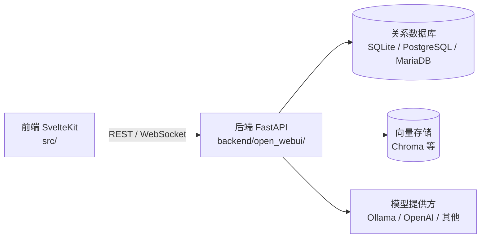

# Open WebUI 架构说明

本文档描述 Open WebUI（当前 `main` 分支，版本 0.11.0）的代码组织与系统架构，帮助读者快速建立对项目整体结构的认知。内容聚焦「架构与结构」，不重复 README 中的功能与安装说明。

## 1. 项目概览

Open WebUI 是一个前后端分离的单仓库（monorepo）应用，提供面向大语言模型的聊天、模型管理、知识库与检索增强（RAG）等能力。整体分为三层：基于 SvelteKit 的浏览器前端、基于 FastAPI 的后端服务，以及由 SQLAlchemy 与多种向量库组成的数据/检索层，最终通过 Docker 统一交付。



## 2. 技术栈

**前端**

- Svelte 5 + SvelteKit（文件路由）
- Vite、TypeScript、Tailwind CSS 4
- 前端状态管理位于 `src/lib/stores/`，国际化位于 `src/lib/i18n/`

**后端**

- FastAPI + Uvicorn（ASGI）
- Pydantic（数据校验）、SQLAlchemy（异步 ORM）、Alembic（数据库迁移）
- 环境配置统一由 `open_webui/env.py` 与 `open_webui/config.py` 读取

**基础设施**

- Docker / Docker Compose 作为主要交付方式
- Python 依赖与打包使用 hatchling（配置在 `pyproject.toml`），依赖锁定在 `uv.lock`
- 前端依赖与脚本管理在 `package.json`

## 3. 顶层目录结构

```text
.
├── backend/               # Python FastAPI 后端
├── src/                   # SvelteKit 前端源码
├── static/                # 构建时复制的静态资源（图标、字体、Pyodide、音频等）
├── docs/                  # 项目文档（含本架构说明）
├── scripts/               # 构建辅助脚本（Pyodide 准备、SBOM 生成）
├── test/                  # 测试素材
├── .github/               # CI/CD 工作流与 issue 模板
├── Dockerfile             # 应用镜像构建定义
├── docker-compose*.yaml   # 多种部署组合（GPU、Ollama、API、数据、OTel、Playwright 等）
├── pyproject.toml         # 后端打包、依赖与工具配置
├── package.json           # 前端依赖、脚本与版本号（版本为前后端共享的单一来源）
└── Makefile               # 汇总常用开发命令
```

## 4. 后端架构

后端代码位于 `backend/open_webui/`，按职责分层：

- `routers/` — HTTP API 层，按业务域拆分路由模块，覆盖聊天、模型、用户、认证、知识库、文件、图像、音频、任务、自动化、日历、频道、终端、SCIM 等。
- `models/` — SQLAlchemy ORM 层，定义用户、聊天、消息、知识库、文件、工具、函数等核心实体。
- `utils/` — 业务/服务层，承载鉴权、OAuth、RAG 上下文压缩、代码解释器、Webhook、Redis、插件、PDF 生成等通用能力；其中含 `mcp/`、`telemetry/`、`images/`、`access_control/` 等子包。
- `retrieval/` — 检索增强（RAG）子系统，包含 `loaders/`（文档加载）、`vector/`（向量库适配）、`web/`（网页检索）与 `models/`。
- `internal/db.py` — 数据库会话与连接管理。
- `migrations/` — Alembic 数据库迁移脚本。
- `socket/` — WebSocket 事件处理；`storage/` 与 `tools/` 分别负责存储与工具执行。

一次请求通常按以下链路流转：

```text
HTTP 请求 → routers/（API 层）→ utils/（业务/服务层）→ models/ + internal/db.py（ORM 与数据访问）→ 数据库
```

服务入口由 `pyproject.toml` 定义：`open-webui = "open_webui:app"`。

## 5. 前端架构

前端代码位于 `src/`，采用 SvelteKit 文件路由：

- `routes/` — 页面路由。核心业务页面位于 `routes/(app)/` 下：`admin`、`workspace`、`chat`、`channels`、`playground`、`automations`、`calendar`、`folders`、`notes`、`home`；此外还有 `auth` 与 `error` 等独立路由。
- `lib/components/` — 可复用组件，按 `chat`、`common`、`admin`、`layout`、`icons` 等业务域划分。
- `lib/apis/` — 对后端 REST 接口的前端调用封装。
- `lib/stores/`、`lib/utils/`、`lib/types/`、`lib/constants/` — 状态管理、工具函数、类型与常量。
- `lib/i18n/` — 多语言资源；`lib/workers/` — Web Worker；`lib/pyodide/` — 浏览器内 Python 运行环境。

前端通过 REST 接口与 WebSocket 与后端通信，页面组件调用 `lib/apis/` 中的封装发起请求，并借助 store 维护客户端状态。

## 6. 数据与持久化

- **关系数据**：默认使用 SQLite（`DATA_DIR/webui.db`），也支持 PostgreSQL 与 MariaDB。schema 通过 Alembic 迁移管理，迁移脚本位于 `backend/open_webui/migrations/`。
- **向量数据**：默认使用 Chroma（`VECTOR_DB=chroma`），`retrieval/vector/` 同时适配 Chroma、Elasticsearch、OpenSearch、Milvus、Qdrant、Weaviate、Pinecone、pgvector、MariaDB vector、Oracle 23ai、Valkey 等多种向量库。
- **文件与缓存**：上传文件与缓存分别放在 `DATA_DIR/uploads` 与 `DATA_DIR/cache`。

## 7. 核心运行流程

一次典型的问答请求端到端链路如下：

```text
用户提问
  → 前端 chat 组件 / API
  → 后端 chats 路由
  → 知识库检索（retrieval/） + 模型调用（Ollama / OpenAI / 其他提供方）
  → 流式响应（SSE / WebSocket）
  → 前端实时渲染
```

## 8. 部署与运行

- **容器化**：`Dockerfile` 定义镜像构建，`docker-compose.yaml` 提供默认组合，另有多份 `docker-compose.*.yaml` 用于 GPU、Ollama 捆绑、纯 API、数据持久化、OpenTelemetry、Playwright 等场景。
- **后端**：通过 `pip install` 安装后使用 `open-webui` 命令启动，或直接运行 `open_webui` 包。
- **前端开发**：`npm run dev`（开发）与 `npm run build`（构建）；构建前会先执行 Pyodide 预取脚本 `scripts/prepare-pyodide.js`。

## 9. 质量与工具

- 前端检查：`npm run lint`、`npm run check`、`npm run test:frontend`（ESLint、Svelte Check、Vitest）。
- 后端检查：Ruff、Black、pylint（可经 `Makefile` 或对应命令执行）。
- 数据库变更使用 Alembic 迁移；持续集成配置位于 `.github/`。
